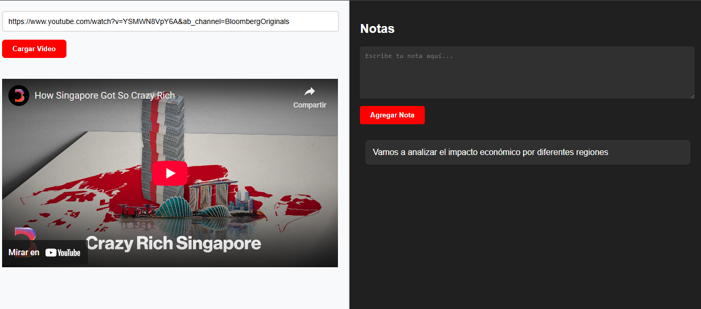

# YouTube + Notas - Aplicación Web

## Descripción
Aplicación web dividida en dos secciones principales:
1. **Reproductor de YouTube**: Permite ingresar URLs de videos de YouTube para visualizarlos
2. **Bloc de notas**: Área para crear y almacenar notas con estilo oscuro

## Características principales
- **Cargador inteligente de videos**: Extrae el ID del video desde cualquier URL de YouTube válida
- **Reproductor responsive**: Se adapta a cualquier tamaño de pantalla manteniendo relación 16:9
- **Bloc de notas dinámico**:
  - Campo de texto con ajuste automático de altura
  - Almacenamiento temporal de notas (no persistente)
  - Diseño oscuro con efectos de sombras
- **Validación de URLs**: Alertas para URLs inválidas
- **Interfaz moderna**: Diseño limpio inspirado en la paleta de colores de YouTube
